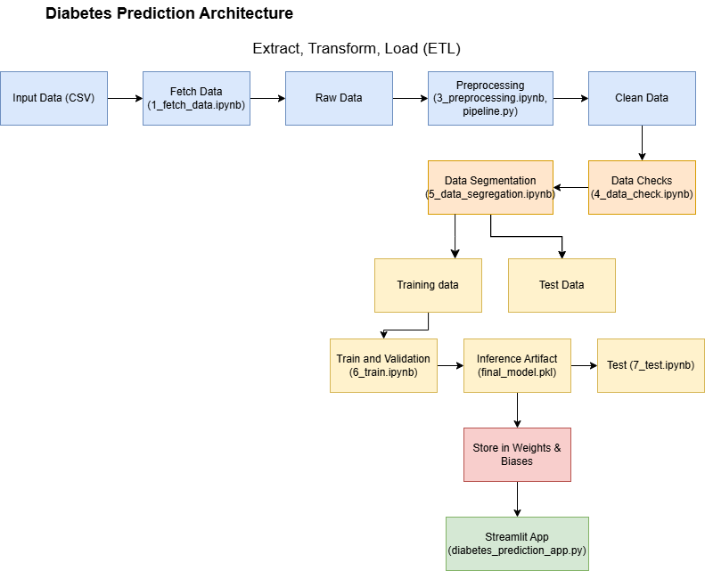
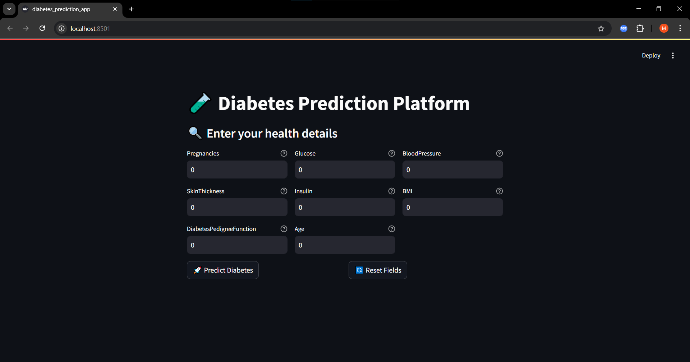

# 📊 Diabetes Prediction App
## Introduction

This project aims to develop a simple and user-friendly Streamlit application that enables patients to estimate their risk of diabetes at home based on medical test results. By inputting key health metrics such as age, BMI, HbA1c levels, and blood glucose, users can receive a quick prediction of their diabetes risk. The application leverages a machine learning model trained on a diabetes dataset to provide accurate and reliable predictions.

The project is built using the following technologies:

- Python: Core programming language for data processing and model development.
- Streamlit: Framework for creating an interactive web-based user interface.
- scikit-learn: Library for building and training the machine learning model.
- pandas and NumPy: Libraries for data manipulation and numerical computations.
- joblib: Used for saving and loading the trained machine learning model.

## Model Card

The model was deployed to the web using the Streamlit package, creating an interactive user interface for predictions. The application was integrated into a CI/CD framework using GitHub Actions, as defined in the .github/workflows/deploy.yml file. After building and testing the Streamlit app locally, it was prepared for deployment, with potential live testing supported by the infrastructure. Weights & Biases were utilized to manage and track all artifacts, including the trained model (final_model.pkl) and pipeline (final_pipeline.pkl), stored and monitored through the platform



So, in general, the notebooks used were divided into 7 parts:

 1. The search for data
 2. Exploratory analysis
 3. Pre-Processing
 4. Tests
 5. Splitting the data between training and testing.
 6. Training
 7. Test

## 🚀 Key features
- Train on the Pima Indian Diabetes dataset
- Complete preprocessing pipeline (handling zero values, feature creation, encoding, feature selection)
- XGBoost model with parameters optimized by Optuna
- Streamlit interface for direct prediction visualization
- Track and store the model with Weights & Biases (W&B)
---

## 🗂️ Folder Structure

```
diabetes-prediction/
├── data/
│   └── raw_data/
├── model/
│   ├── final_model.pkl
│   ├── final_pipeline.pkl
│   └── pipeline_diabetes.pkl
├── notebooks/
│   ├── 1_fetch_data.ipynb
│   ├── 2_eda.ipynb
│   ├── 3_preprocessing.ipynb
│   ├── 4_data_check.ipynb
│   ├── 5_data_segregation.ipynb
│   ├── 6_train.ipynb
│   └── 7_test.ipynb
├── source/
│   └── api/
│       ├── __init__.py
│       ├── pipeline.py
│       ├── pipeline_config.py
│       ├── test_diabetes_prediction.py
│       └── diabetes_prediction_app.py
├── .github/workflows/deploy.yml
├── requirements.txt
├── Dockerfile
└── README.md
```

---

## 🗂️ Folder Structure Details
- data/:
  Contains the raw dataset used for training and testing the model. The raw_data/ subdirectory stores the original CSV files (e.g., Pima Indian Diabetes dataset) fetched during the data ingestion phase.

- model/:
  Stores the trained machine learning artifacts, including final_model.pkl (the trained XGBoost model), final_pipeline.pkl, and pipeline_diabetes.pkl (preprocessing pipelines saved using joblib). These files are managed and tracked via Weights & Biases.

- notebooks/:
  Contains Jupyter notebooks for the development and experimentation phases:
    * 1_fetch_data.ipynb: Handles data ingestion from the source.
    * 2_eda.ipynb: Performs exploratory data analysis (EDA) to understand the dataset.
    * 3_preprocessing.ipynb: Implements data preprocessing steps (e.g., handling missing values, encoding).
    * 4_data_check.ipynb: Conducts data quality checks.
    * 5_data_segregation.ipynb: Splits data into training and testing sets.
    * 6_train.ipynb: Trains the XGBoost model and logs metrics to Weights & Biases.
    * 7_test.ipynb: Evaluates the trained model on the test set.

- source/:
  Houses the core Python scripts for the project:

- api/: Contains application logic:
    * __init__.py: Initializes the package.
    * pipeline.py: Defines the data preprocessing and model training pipeline.
    * pipeline_config.py: Configures pipeline parameters.
    * test_diabetes_prediction.py: Includes unit tests for the prediction logic.
    * diabetes_prediction_app.py: Implements the Streamlit application for user interaction and prediction.

- .github/workflows/:
  Contains deploy.yml, which defines the CI/CD pipeline using GitHub Actions to automate testing and deployment processes.

- requirements.txt:
  Lists all Python package dependencies with specific versions (e.g., streamlit==1.45.0, scikit-learn==1.1.3) required to run the project.

- Dockerfile:
  Provides instructions to build a Docker container for the application, enabling consistent deployment across environments.

- README.md:
  Serves as the project documentation, detailing the setup, usage, and structure of the repository.
  
## ⚙️ Virtual Environment
```bash
# Clone repository
git clone https://github.com/pham-ngoc-nhi/diabetes-prediction.git
cd diabetes-prediction

# Create and activate a virtual environment
python -m venv .venv

# To activate this environment , use the following command:
- For Linux, macOS
source .venv/bin/activate
- For Windows command line
.venv\Scripts\activate
- For Windows PowerShell
.venv\Scripts\Activate.ps1

# Install the dependencies
pip install -r requirements.txt
```

---

## Practice Notebooks
To understand the procedures of designing code locally, including important steps like fetching data, visualization, preprocessing, checking data, segregating data, training, and testing, you should run all notebooks step-by-step in the notebooks/ directory. Note that you should select the correct kernel (.venv) to avoid library conflicts.

You should register with Weights & Biases to store all artifacts, metrics, and models. You can create an account on wandb.ai. After that, create a .env file in the notebooks/ directory with the following content:
```bash
WANDB_API_KEY=Your_key_here
```

---
This WANDB_API_KEY is used to log into your W&B project inside each notebook.

## Streamlit 

The Streamlit app is implemented in source/api/diabetes_prediction_app.py, while tests are located in source/api/test_diabetes_prediction.py.

To run the Streamlit app locally for development and testing, use:
```bash
streamlit run source/api/diabetes_prediction_app.py
```

---
The screenshot below show a view of the Streamlit interface:

This will launch the app at http://localhost:8501, where you can interact with the prediction interface.

To test the app, run:
```bash
pytest source/api -vv -s
```

---
## ▶️ Run the application

```bash
streamlit run source/api/diabetes_prediction_app.py
```

---

## 🧠 Retrain the model

```bash
python source/api/pipeline.py
```

---

## 📝 Input example

| Indicator                  | Sample value|
|----------------------------|-------------|
| Pregnancies                | 2           |
| Glucose                    | 130         |
| BloodPressure              | 70          |
| SkinThickness              | 25          |
| Insulin                    | 100         |
| BMI                        | 28.5        |
| DiabetesPedigreeFunction   | 0.6         |
| Age                        | 35          |

---

## 🧪📋 Unit Tests Overview

This project includes three structured sets of unit tests to ensure **data integrity**, **model reliability**, and **full evaluation visualization**, using `pytest` and `Weights & Biases`.

---

### ✅ 1. Data Validation Tests (`test_data.py`)

These tests validate the dataset downloaded from Weights & Biases before it is used in training or inference:

| Test Name                      | Description |
|-------------------------------|-------------|
| `test_no_missing_values`      | Checks for any missing (null) values in the dataset |
| `test_class_balance`          | Ensures that the `OUTCOME` classes are not severely imbalanced |
| `test_duplicate_rows`         | Flags any duplicate rows |
| `test_data_length`            | Ensures the dataset has more than 500 rows |
| `test_number_of_columns`      | Confirms that the dataset contains enough columns (≥ 9) |
| `test_column_presence_and_type` | Validates that `OUTCOME` is integer type and all features are numeric |
| `test_class_names`            | Confirms that `OUTCOME` contains only valid values (0 or 1) |
| `test_column_ranges`          | Ensures numeric columns have reasonable values (non-negative, not extreme) |

Run this test suite with:

```bash
pytest test_data.py -vv -s
```

---

### ✅ 2. Model Inference Tests (`test_diabetes_prediction.py`)

These tests validate the trained model and its prediction logic:

| Test Name                           | Description |
|------------------------------------|-------------|
| `test_model_prediction_diabetic`   | Tests prediction with input resembling a diabetic case |
| `test_model_prediction_not_diabetic` | Tests prediction with input resembling a healthy case |

These tests ensure the model:

- Can be loaded from disk (`final_model.pkl`)  
- Returns valid predictions (`0` or `1`)  
- Can accept realistic input values  

Run this test suite with:

```bash
pytest source/api/test_diabetes_prediction.py -vv -s
```

---

### ✅ 3. Evaluation Visualization & W&B Logging (`7_test.ipynb`)

After model evaluation, the following items are automatically logged to **Weights & Biases (W&B)** for performance tracking and visualization:

| Logged Component            | Description |
|----------------------------|-------------|
| `accuracy`, `precision`, `recall`, `f1`, `AUC` | Core model metrics (both default and tuned thresholds) |
| `confusion_matrix_image`   | Confusion Matrix plotted and logged as a W&B image |
| `roc_curve_image`          | Receiver Operating Characteristic (ROC) curve with AUC |
| `precision_recall_curve`   | Precision-Recall curve for imbalanced classification |
| `classification_report`    | Logged as a W&B table showing precision, recall, F1-score per class |

To run and log these evaluations, execute all cells in:

```bash
notebooks/7_test.ipynb
```

---

## 📌 Notes

- Ensure you use the correct versions of `scikit-learn==1.1.3` and `numpy==1.23.5` to maintain compatibility with the saved model.
- All artifacts are stored on the W&B project: [W&B project](https://wandb.ai/ngocnhi-p4work-national-economics-university/diabetes)

---

## 📈 Future Development Directions

To further improve this project, the following enhancements are planned or recommended:

- **📊 Model Improvement**
  - Try additional classifiers (e.g., LightGBM, CatBoost, Ensemble Stacking)
  - Use SHAP or LIME for explainability
  - Optimize threshold using cost-sensitive evaluation

- **💻 Application Features**
  - Add user authentication for personalized tracking
  - Enable batch predictions via CSV upload
  - Display confidence scores and top contributing features for each prediction

- **📦 Deployment**
  - Deploy on a scalable platform (e.g., AWS, Azure, GCP)
  - Integrate CI/CD for model retraining on new data
  - Use Docker Compose or Kubernetes for multi-service orchestration

- **🧪 Monitoring & Feedback**
  - Implement drift detection and alerting (e.g., with Evidently or W&B Triggers)
  - Collect real-world feedback from users and retrain periodically
  - Track real-time usage and performance in production

- **📱 UI/UX Enhancements**
  - Improve mobile responsiveness and accessibility
  - Add multi-language support for wider reach
  - Embed visualizations using interactive Plotly or Streamlit charts

These improvements aim to turn the app from a proof-of-concept into a production-ready health risk tool.

---
